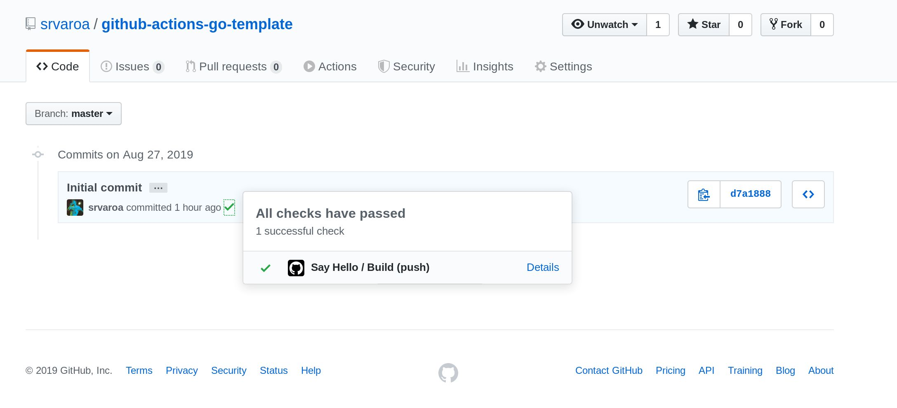
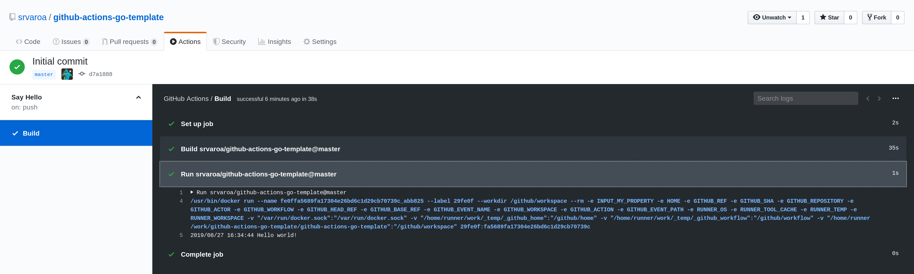

# GitHub Actions Go Template

This is a template for a [GitHub
Action](https://help.github.com/en/categories/automating-your-workflow-with-github-actions)
written in Go 1.12.  I put it together after building my [Labeler
action](https://github.com/srvaroa/labeler/releases/) (which you can use
as a real-life example).  Below is a brief explanation of all the pieces
so you can start your own action from there.  There will be inacuracies
and mistakes (I have inferred much of this info from existing actions,
and the GitHub docs are still under development).  Feel free to throw an
Issue or PR at me with corrections.

## Pieces

### [cmd/action.go](cmd/action.go)

This is your application code.  In our template we simply output "Hello
World!" to the Action's execution log.  Just change this code.

### [Dockerfile](Dockerfile)

The main purpose of this file is to define the container that your code
will run in.

You don't need to publish the container to a Docker registry: GitHub is
able to execute your action by giving it a reference to your repo (such
as `srvaroa/github-action-go-template@master`).  However, if you chose
this option the container will be built in every single execution of the
action (in other words, it'll be slower to execute.)

If you're wondering about which icons are available, you can chose any
from [feathericons.com](https://feathericons.com/)

### [action.yml](action.yml)

This file defines metadata for the action.  Some of it seems redundant
with the [Dockerfile](Dockerfile) so I suspect some of this may
dissappear after the Beta period.  The documentation I could find for
this file is at [Actions
toolkit](https://github.com/actions/toolkit/blob/master/docs/container-action.md#define-metadata)

I'll skip the bits that are self-explanatory. Two sections are more
interesting:

#### Runs

    runs:
      using: 'docker'
      image: 'Dockerfile'

GitHub actions
[supports](https://github.com/actions/toolkit/blob/master/docs/action-types.md)
two types of actions NodeJs or Docker containers.  In our case we need a
container so we set 'docker'.

The `image` property lets us tell GitHub how to get the executable
version of our action.  In our case, we're setting `Dockerfile` to
specify we want it to use the [#Dockerfile] in our repo.  If you prefer
to publish an image to a registry, then you should change this value
to the image reference.

#### Inputs 

    inputs: 
      my_property:
        description: "My custom input property"
        default: "some_default_value"

This defines a configuration option `my_property` with a `description`
and a `default` value.  This property is made available to your
application as an environment variable `INPUT_MY_PROPERTY` that is
injected in your container by the GitHub Actions runtime.

These properties are useful if you want to give users of your action the
ability to pass configuration to the action.  The owner of the repo
would add a `with` property to the `uses` section:

        - uses: srvaroa/github-actions-go-template@master
          with:
            my_property: some_other_value

A real example of an action that uses this feature extensively is the
[Checkout
action](https://github.com/actions/checkout/blob/master/action.yml).
I'll show how to use it below.

## Using your action from another repo

To execute the action from any other repository, you only need to create
a workflow definition file like
[.github/workflows/main.yml](.github/workflows/main.yml).

    name: Say Hello
    on: [push]
    jobs:
      build:
        runs-on: ubuntu-latest
          steps:
            - uses: srvaroa/github-actions-go-template@master

This will execute the action `srvaroa/github-actions-go-template`, from
the master branch, on every push to the repo.

Here are a couple of screenshots of how it working, [commits in the master 
branch](https://github.com/srvaroa/github-actions-go-template/commits/master) now get a check if the action passes.

    

If you click on details, you see the full log.

    

After writing your own action, just change the `uses` section as
appropriate and you're set.  You probably want to use a SHA or a tag
instead of `master`.

To override the default for `my_property` that we declared [in the
inputs section](#inputs), the workflow file would look like this.

    name: Say Hello
    on: [push]
    jobs:
      build:
        runs-on: ubuntu-latest
          steps:
            - uses: srvaroa/github-actions-go-template@master
              with:
                my_property: some_other_value

Check the [official
documentation](https://help.github.com/en/categories/automating-your-workflow-with-github-actions)
for workflows if you want more info on using actions.

## Developing

You can build and run your container locally with:

    $ docker build -t github-actions-go-template .
    $ docker run -it github-actions-go-template
    2019/08/27 15:49:14 Hello world!

## More info

The *old* documentation is at
https://developer.github.com/actions/creating-github-actions/, but it
will be removed on Sept 30th 2019 according to the deprecation notice.

The new documentation is at https://help.github.com/en/categories/automating-your-workflow-with-github-actions
